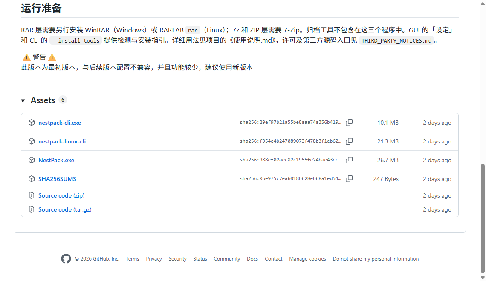

# 从 GitHub 下载、更新和反馈问题

[返回首页](../README.md) · [图文入门](入门教程.md) · [常见问题](常见问题.md)

> **当前下载状态**：公开发布页目前只有早期 v1.0.0。图文教程对应当前项目的新版界面，新版程序尚未公开发布；早期版本的界面、功能和配置结构与当前源码有差异。

## 下载哪个文件

1. 打开 [NestPack 发布页](https://github.com/codeTianZun/NestPack/releases)。从项目首页进入时，也可以点击右侧的 **Releases**。
2. 阅读该版本的说明，确认适用系统、功能和更新注意事项。
3. 找到 **Assets**（下载文件列表）。列表收起时，点击它展开。
4. 按下表选择文件，点击文件名下载。公开发布文件可以直接下载，无需注册 GitHub 账号。

| 使用方式 | 下载文件 | 下载后怎么打开 |
|---|---|---|
| Windows x64，使用窗口操作 | `NestPack.exe` | 放进一个能正常保存文件的文件夹，双击运行 |
| Windows x64，使用命令行或数字菜单 | `nestpack-cli.exe` | 双击进入数字菜单，或在终端中运行 |
| Linux x86_64，使用命令行 | `nestpack-linux-cli` | 在终端赋予执行权限后运行，见下方命令 |

三个程序按需下载，均自带 Python 运行时。使用 Windows 图形界面时，下载 `NestPack.exe` 即可。



*图中展示公开 v1.0.0 的下载文件列表；具体功能和界面以所选版本的说明为准。*

列表中的其他文件用途如下：

- **Source code (zip) / Source code (tar.gz)**：项目源码，适合自行运行或构建程序。下载后会看到代码文件和文件夹。
- **SHA256SUMS**：用于核对下载文件是否完整的校验值列表。

项目首页绿色 **Code → Download ZIP** 下载的也是源码。需要直接使用程序时，请选上表中的可执行文件。GitHub 对两类下载的区别也有[官方说明](https://docs.github.com/en/repositories/working-with-files/using-files/downloading-files-from-github)。

Linux 用户在文件所在目录运行：

```bash
chmod +x nestpack-linux-cli
./nestpack-linux-cli
```

## 第一次打开前

建议为 NestPack 建一个固定文件夹，例如 `D:\工具\NestPack`，再把程序放进去。程序会在同一目录保存任务配置；通过程序安装的 7-Zip 也放在这里。

启动后，按所用格式准备压缩工具：7z 和 ZIP 使用 7-Zip，RAR 使用 WinRAR（Windows）或 RARLAB rar（Linux）。当前新版界面的具体操作见[图文入门](入门教程.md#准备压缩工具)。

## 更新程序

有新版本发布后，可按以下步骤更新：

1. 打开[发布页](https://github.com/codeTianZun/NestPack/releases)，查看新版本说明。若该版本要求迁移配置，先按版本说明处理。
2. 等待任务完成，退出旧程序。
3. 备份使用中的配置文件。默认文件名为 `nestpack_config.json`；另存过配置时，也备份自己保存的文件。
4. 下载对应系统的新程序，用它替换原文件夹里的同名程序。
5. 保留原目录里的配置文件、`nestpack_gui_state.json` 和 `dependencies` 文件夹，再启动新程序。

配置文件保存来源、输出目录、压缩层等设置，并可能包含明文密码，请把备份放在自己保管的位置。

程序文件名通常不含版本号。记录下载页面上的版本和日期，反馈问题时一并提供；自行构建的程序还应注明源码来源。

## 遇到问题怎么反馈

先查[常见问题](常见问题.md)。仍无法解决时，可以在 [Issues](https://github.com/codeTianZun/NestPack/issues)（问题反馈区）留下记录。

1. 登录 GitHub；没有账号时，按网站提示注册。
2. 打开 Issues，搜索报错中的关键词，看是否已有同类问题和解决方法。
3. 点击 **New issue**（新建问题）。
4. 在标题中写出遇到的现象，例如“Windows：7z 压缩开始后提示找不到工具”。
5. 在正文中填写系统、版本、操作步骤和完整报错，然后点击 **Submit new issue**（提交问题）。按钮名称以 GitHub 当时的界面为准。

可以复制下面的格式填写：

```text
系统：Windows 11，64 位
程序来源：GitHub 发布页 / 自行构建
版本或下载日期：

想完成什么：

操作步骤：
1.
2.
3.

预期结果：
实际结果：
完整报错：

补充信息：所用格式、层数、是否分卷，以及 WinRAR / 7-Zip 的检测结果。
```

截图可以拖进正文输入框，也可以通过输入框下方的附件入口添加。GitHub 官方提供了[新建问题](https://docs.github.com/en/issues/tracking-your-work-with-issues/using-issues/creating-an-issue)和[上传附件](https://docs.github.com/en/get-started/writing-on-github/working-with-advanced-formatting/attaching-files)的详细步骤。

**Issues 和附件是公开的。** 提交前检查截图与日志，遮住密码和私人文件路径。配置文件可能含明文密码；需要展示设置时，可以填写不含私人信息的示例。

## 去哪里找日志

程序能打开时，点击「查看日志」，复制与失败操作相关的内容。

Windows 程序打不开时，按 `Win + R`，粘贴下面的路径并回车：

```text
%LOCALAPPDATA%\NestPack\logs
```

打开其中的 `nestpack.log`。如果日志文件尚未生成，反馈时说明“双击无窗口且未生成日志”，并附上系统提示。

Linux 默认日志路径为 `~/.local/share/nestpack/logs/nestpack.log`；设置了 `XDG_DATA_HOME` 时，日志位于该目录下的 `nestpack/logs/`。
