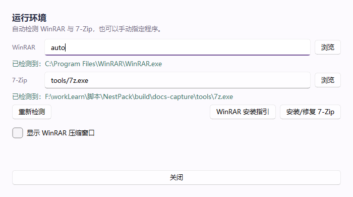
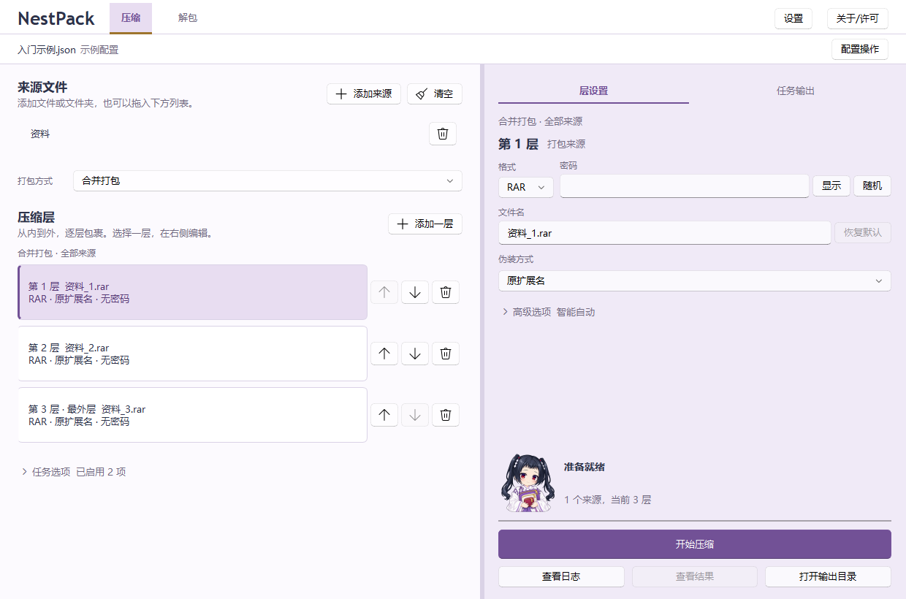
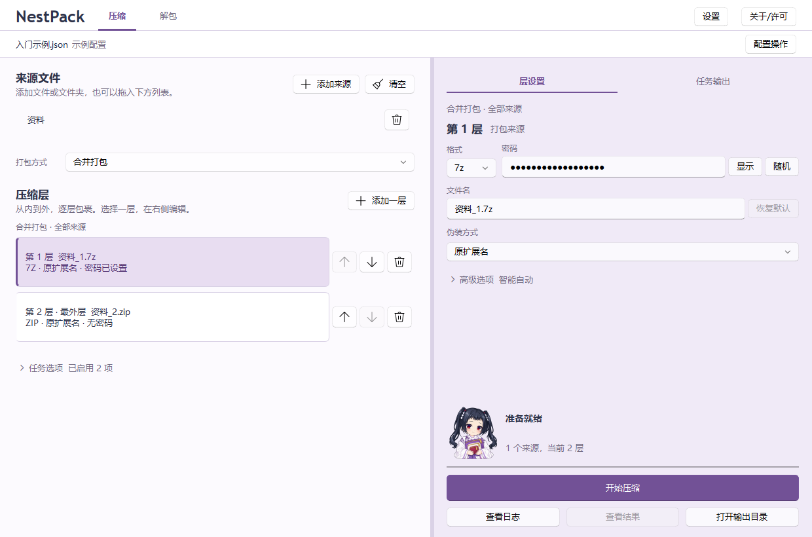
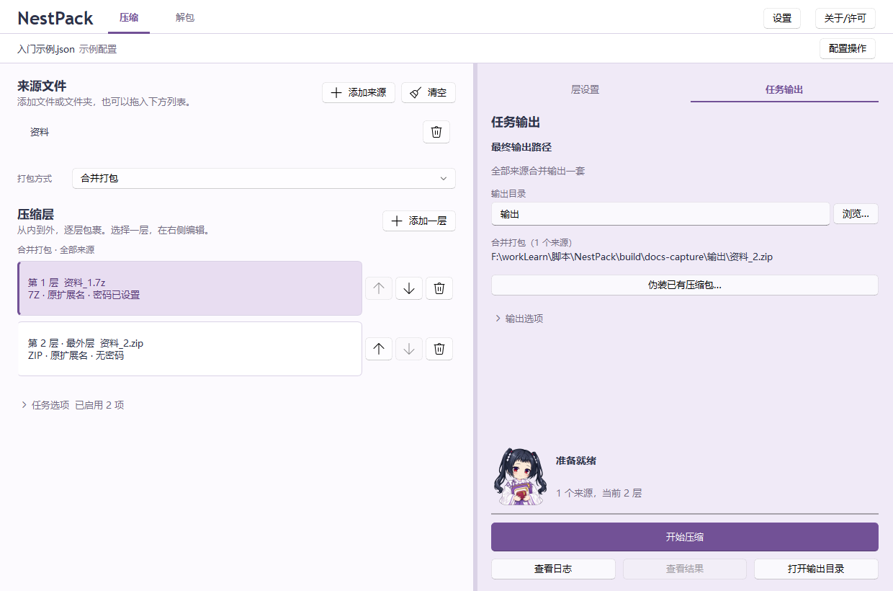
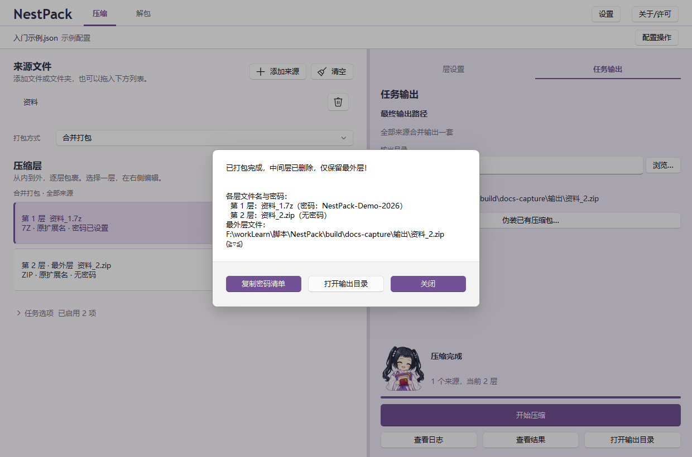
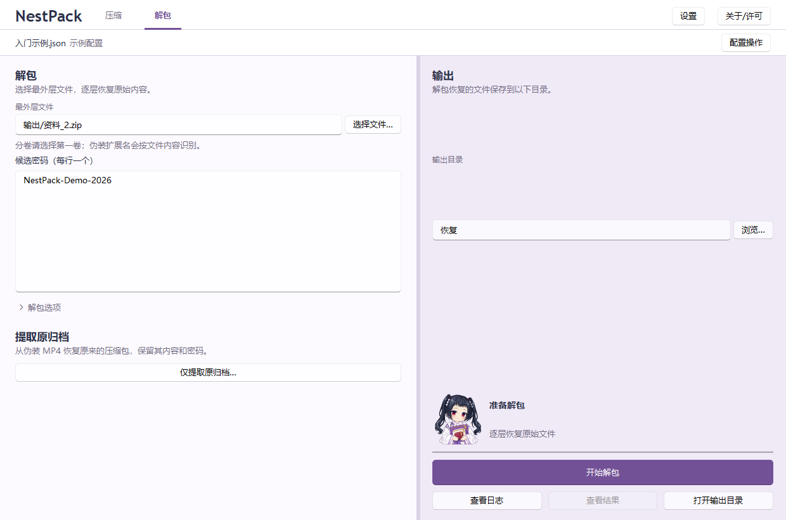
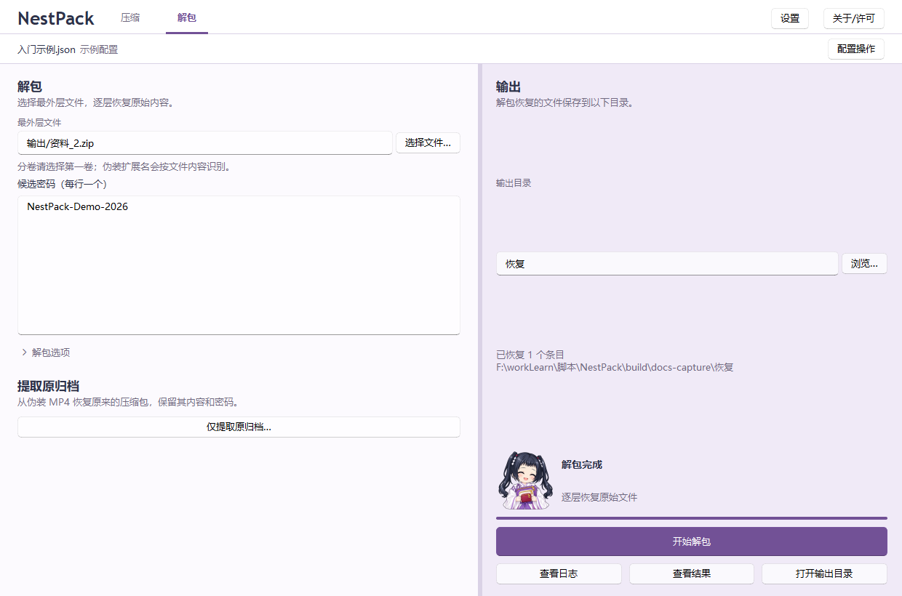

# 图文入门：完成一次两层压缩与解包

[返回首页](../README.md) · [进阶用法](进阶用法.md) · [常见问题](常见问题.md)

本教程面向使用 Windows 图形界面的用户。操作示例是给一个“资料”文件夹加上两层压缩，再把它解开。

> **适用界面**：截图来自当前项目的新版 Windows 界面，对应的新版程序尚未公开发布。GitHub 上的早期 v1.0.0 使用旧界面。当前源码的运行与构建方法见[打包说明](../打包说明.md)；已发布程序的下载方法见[GitHub 下载指南](GitHub下载与反馈.md)。

## 本次要得到什么

准备一个名为 `资料` 的文件夹，放入两三个普通文件。再建两个空文件夹：`输出` 用来保存压缩包，`恢复` 用来存放解包结果。

```text
资料文件夹
  ↓ 第 1 层：7z，设置密码
资料_1.7z
  ↓ 第 2 层：ZIP，密码留空
资料_2.zip ← 最终分享的文件
```

“第一层”直接包含原始文件，后续每层再包住上一层。界面里的层列表按从内到外排列。

截图使用专用示例文件，路径按你的实际目录选择。示例密码为 `NestPack-Demo-2026`，用于复现教程；处理自己的文件时请设置自己的密码。

## 准备压缩工具

NestPack 负责安排压缩步骤，实际压缩由 7-Zip 或 WinRAR 完成。本例的 7z 和 ZIP 两层都使用 7-Zip。

1. 打开 NestPack，点击右上角「设置」。
2. 查看 7-Zip 一栏。路径默认的 `auto` 表示自动查找。
3. 如果尚未检测到工具，点击「安装/修复 7-Zip」，按窗口提示确认安装，等待下载和校验完成。
4. 点击「重新检测」，确认 7-Zip 显示“已检测到”。然后关闭设置窗口。



*工具路径取决于安装位置。图中使用为演示单独准备的 7-Zip；通常保持 `auto` 即可。*

程序内安装的 7-Zip 保存在 NestPack 同目录的 `dependencies/7z`，后续运行会继续使用。若检测结果注明“仅支持 7z”，请通过「安装/修复 7-Zip」准备支持 ZIP 的完整工具。

需要使用 RAR 时，再通过「WinRAR 安装指引」安装 WinRAR。本例只使用 7z 和 ZIP。

## 添加资料文件夹

1. 在顶部选择「压缩」。
2. 点击左侧「添加来源」，选择刚才准备的 `资料` 文件夹。也可以将文件夹直接拖入来源列表。
3. 「打包方式」保持「合并打包」。



初次启动默认有三层 RAR。如果之前使用过程序，它会载入上次的配置。按本教程操作前，确认来源列表里只有本次需要的 `资料` 文件夹。

## 设置两层压缩

先把左侧的压缩层调整为两层：点击多余层右侧的垃圾桶图标「删除这一层」；不足两层时点击「添加一层」。

然后分别点击第 1 层和第 2 层，在右侧「层设置」中填写：

| 设置 | 第 1 层（内层） | 第 2 层（最外层） |
|---|---|---|
| 格式 | 7z | ZIP |
| 密码 | `NestPack-Demo-2026` | 留空 |
| 文件名 | `资料_1.7z` | `资料_2.zip` |
| 伪装方式 | 原扩展名 | 原扩展名 |

文件名通常会根据来源和层号自动填写，切换格式也会更新后缀。如果显示的是之前手动填写的名称，可点击文件名旁的「恢复默认」。



本例的「高级选项」保持压缩级别「智能自动」、分卷大小留空、自解压关闭。「任务选项」保持开启自检和「自检通过后删除上一层」，其余选项保持关闭。

内层密码保护原始资料。外层 ZIP 的内容可以被查看，其中是一个带密码的 7z 文件；要取出原始资料，仍需要内层密码。

## 选择输出目录并开始压缩

1. 点击右侧「任务输出」。
2. 在「输出目录」旁点击「浏览…」，选择准备好的 `输出` 文件夹。
3. 查看下方的最终路径，确认文件名是 `资料_2.zip`，位置也正确。
4. 点击右下角「开始压缩」。



运行时可以查看进度和日志。需要中止时点击「取消」，等待任务结束。

## 查看结果并保存密码

压缩完成后会弹出结果窗口，列出每层的名称、密码和最外层文件位置。



1. 点击「复制密码清单」，粘贴到自己保管的文本文件或密码管理工具中。
2. 点击「打开输出目录」，找到 `资料_2.zip`。
3. 关闭弹窗后，仍可用「查看结果」重新打开本次结果。

本例开启了自检和中间层清理，所以输出目录只保留 `资料_2.zip`。`资料_1.7z` 已包含在 ZIP 内，原始 `资料` 文件夹也仍然保留。

## 解包并检查文件

1. 点击顶部「解包」。
2. 在「最外层文件」旁点击「选择文件…」，选择刚生成的 `资料_2.zip`。
3. 在「候选密码（每行一个）」中填写 `NestPack-Demo-2026`。
4. 在右侧「输出目录」选择准备好的空文件夹 `恢复`。
5. 「解包选项」中的层数保持「自动识别」，点击「开始解包」。



候选密码框只填密码；有多个密码时每行一个。当前配置里已经填写的层密码也会自动参与解包，因此在同一次操作中，留空也可能正常解开。本教程显式填写密码，便于照着向接收者说明。

完成后点击「打开输出目录」，检查 `恢复` 下的 `资料` 文件夹及其中的文件。



## 分享给别人

本例需要交付：

- 文件：`资料_2.zip`。
- 密码：第 1 层的密码。
- 解包说明：在 NestPack 的「解包」页选择 ZIP，填入密码，指定输出目录后开始解包。

接收者也可以先用支持 ZIP 的压缩软件解开外层，再用 7-Zip 输入密码解开内层。

复制出来的密码清单带有层名和本机输出路径。分享前整理为接收者需要的文件名、密码和操作说明；候选密码框只接收每行一个的密码文本。

## 保存和复用设置

界面修改会自动保存到当前配置文件。下次打开时，程序会尝试载入上次的设置。

需要为不同任务保留配置时，点击顶部「配置操作 → 另存配置…」，取一个便于辨认的名字，例如 `资料两层打包.json`。以后通过「配置操作 → 载入配置…」重新使用。

「在配置中保存密码」默认开启，密码以明文保存在配置中。关闭该选项后，密码只保留在当前界面会话中；退出前保存好密码清单，下次重新填写密码。

继续阅读：[多个来源、分卷、视频融合和自解压](进阶用法.md)。遇到问题时查[常见问题](常见问题.md)。
