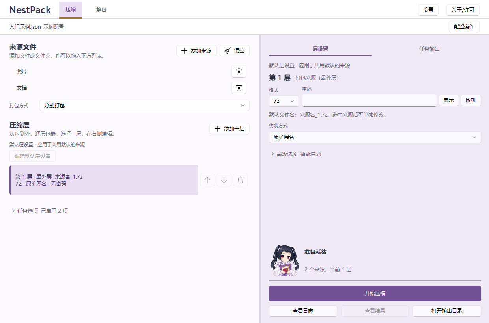
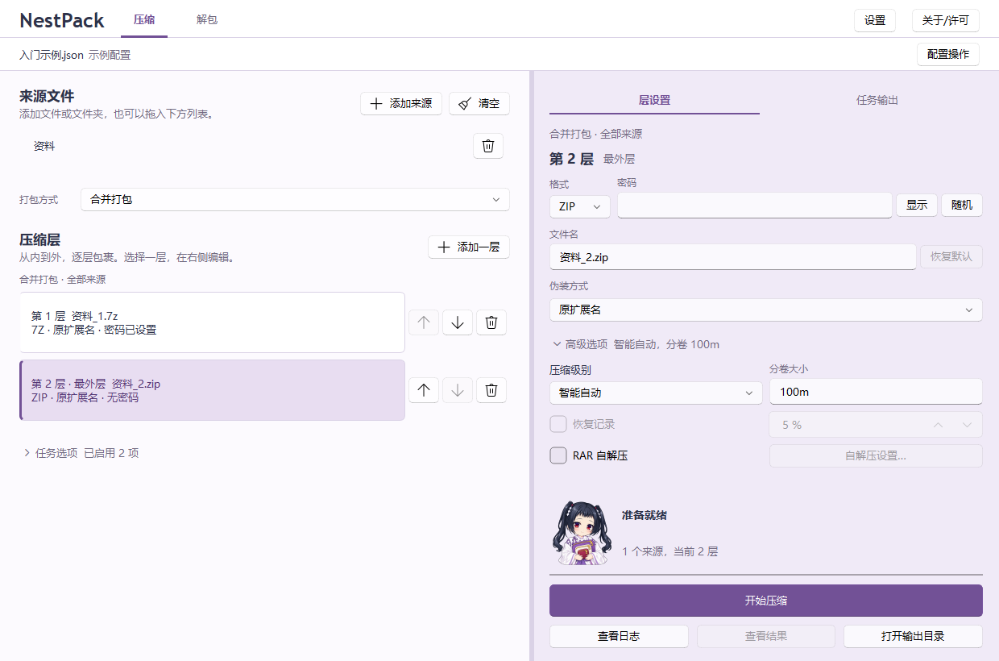
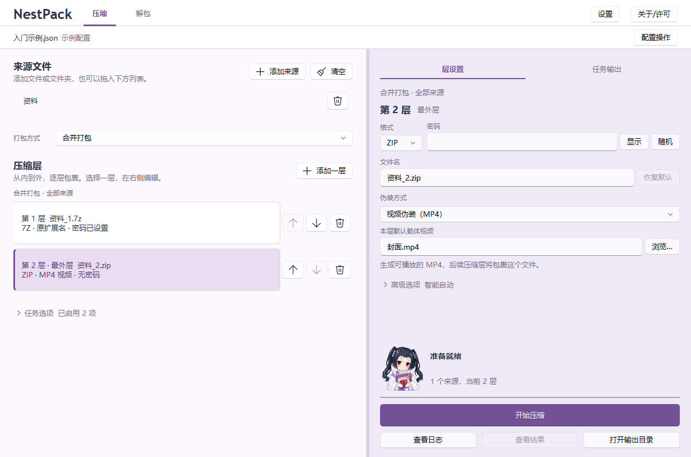
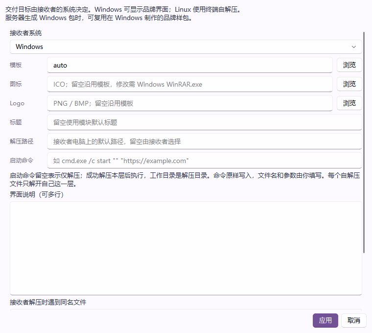

# 进阶用法：分别打包、分卷、视频融合与自解压

[返回首页](../README.md) · [图文入门](入门教程.md) · [常见问题](常见问题.md)

以下案例对应 NestPack 1.1.0 的 Windows 界面。首次使用请先阅读[图文入门](入门教程.md)，完成压缩工具准备。

每个案例都可以单独操作。开始前确认来源、输出目录和层设置与本次任务一致；需要保留原有任务时，先通过「配置操作 → 另存配置…」保存一份。

## 多个文件夹分别打包

适合将“照片”和“文档”等多个文件夹各自压成一套，分别发送给不同的人。

1. 点击「添加来源」，选中需要处理的文件夹，或将它们拖入来源列表。
2. 将「打包方式」改为「分别打包」。
3. 点击「编辑默认层设置」，把层数调整为一层，格式设为 7z，按需填写密码。
4. 点击各个来源，检查它的层设置。如果某个来源此前已有独立设置，需要重新共用默认时，点击「恢复共用默认」。
5. 在「任务输出」选择输出目录，点击「开始压缩」。



本例生成的目录结构为：

```text
输出/
├── 照片/
│   └── 照片_1.7z
└── 文档/
    └── 文档_1.7z
```

需要给某个文件夹设置不同的密码或层数时，先点击该来源，再修改右侧设置。修改后的整套层设置只用于这个来源；其余仍共用默认的来源继续使用默认设置。

分享时，取出对应子目录里的最外层压缩包和所需密码。更多设置关系见[使用说明的 Windows 图形界面部分](../使用说明.md#windows-图形界面)。

## 大文件分卷

适合单个文件大小受到限制的传输场景。分卷会把一套压缩包拆成多个文件，接收者需要收齐后一起解包。

下面在[入门教程](入门教程.md)的两层设置上，将最终 ZIP 按每卷 100 MiB 拆分：

1. 点击第 2 层，也就是列表中的「最外层」。
2. 在右侧「层设置」展开「高级选项」。
3. 在「分卷大小」填写 `100m`，表示 100 × 1024 × 1024 字节。若传输服务限制为十进制 100 MB，应设置更小的值，例如 `95m`。
4. 确认「伪装方式」为「原扩展名」，然后开始压缩。



生成的文件类似：

```text
资料_2.zip.001
资料_2.zip.002
资料_2.zip.003
```

实际卷数取决于压缩后的大小，最后一卷通常较小。源文件很小时也可能只有一卷。

**分享时发送全部分卷。** 接收者将它们放在同一个文件夹，在 NestPack「解包」页选择 `资料_2.zip.001`。7z 分卷从 `.7z.001` 开始，RAR 分卷从 `.part1.rar` 开始。

分卷大小属于当前选中的层。要拆分最终交付文件，应设置最外层；只给内层分卷时，外层仍可能把所有内层分卷装进一个文件。

## 视频融合

适合把压缩包与一段 MP4 结合，得到既能播放视频、又能恢复压缩内容的文件。视频提供画面和声音，归档里的资料保留在同一个成品中。

下面沿用入门教程的两层设置，将最外层 ZIP 融合为 MP4：

1. 准备一个可以正常播放的独立 MP4 文件，例如 `封面.mp4`。
2. 在左侧选择最外层，在「伪装方式」中选择「视频伪装（MP4）」。
3. 在「本层默认载体视频」旁点击「浏览…」，选择 `封面.mp4`。
4. 确认这一层的「分卷大小」留空，「RAR 自解压」关闭。
5. 在「任务输出」核对最终路径，点击「开始压缩」。



本例最终生成 `资料_2.mp4`，其中保留视频画面和声音。成品大小约为视频与归档大小之和。

接收者可以用播放器播放，也可以在 NestPack「解包」页直接选择 MP4，填写归档密码后恢复资料。只想取出其中的压缩包时，使用解包页的「仅提取原归档…」。

需要融合的这一层必须是单文件归档，其他层可以分卷。在内层启用视频融合时，后续层会继续包住该 MP4；要直接交付 MP4，应在最外层设置。

上传网盘后能否在线预览取决于平台，**本地可以播放不代表网盘一定支持**。接收者应下载上传的原文件用于解包；网盘转码后的视频可能不再包含归档数据。详细兼容性与已验证环境见[视频融合说明](../使用说明.md#视频融合)。

## RAR 自解压

适合给 Windows 接收者提供可以双击解压的 EXE。本例使用单层 RAR，让接收者解开这一层就得到原始资料。

1. 在「设置」中通过「WinRAR 安装指引」安装 WinRAR，并点击「重新检测」确认可用。
2. 添加 `资料` 文件夹，保留一层压缩，格式选择 RAR，按需填写密码。
3. 在「高级选项」勾选「RAR 自解压」，点击「自解压设置…」。
4. 「接收者系统」选择 Windows，「模板」保持 `auto`。图标、Logo、标题、解压路径和启动命令可以留空。
5. 点击「应用」，确认本层分卷大小留空、伪装方式为「原扩展名」。
6. 在「任务输出」核对路径，点击「开始压缩」。



本例生成 `资料_1.exe`。接收者在 Windows 中双击，选择解压位置；设置了密码时，还需要输入密码。这个自解压文件自带解压模块，接收者无需另装 NestPack。

`auto` 会查找 WinRAR 的自解压模块。若提示找不到模块，检查是否安装了完整 WinRAR，或在「模板」中选择有效的官方模块、已有品牌样包。

多层任务中，自解压文件只解开自己的这一层。例如外层是 EXE、内层是 7z 时，双击 EXE 得到的是内层 7z，还需继续解压。NestPack 的「解包」可以自动逐层处理。

Linux 自解压、图标与 Logo、分卷自解压和模板复用见[完整自解压说明](../使用说明.md#rar-自解压)。
